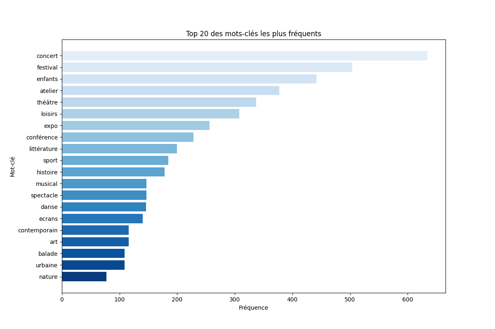
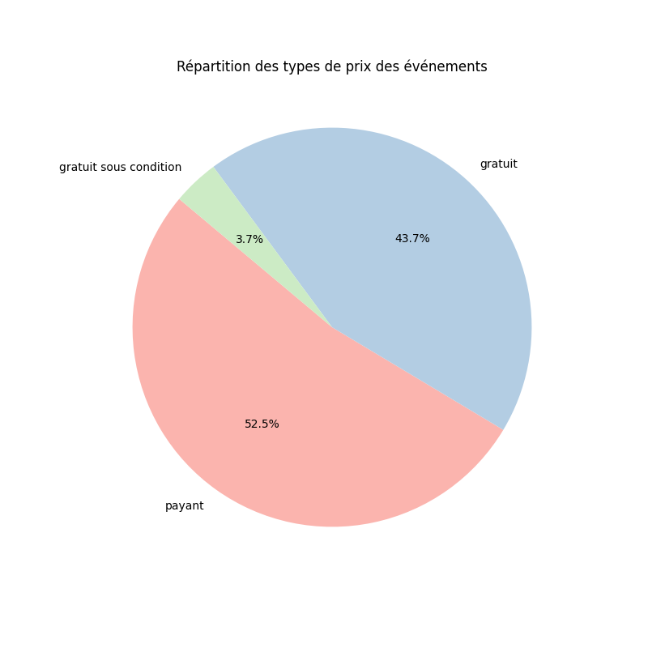
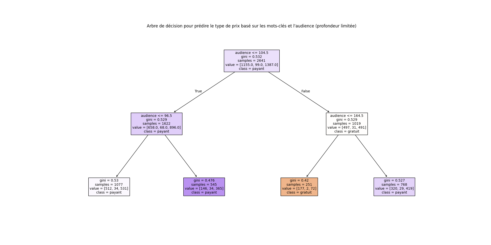

# README - Analyse de l'Arbre de Décision et Présentation du Code

## Introduction
Ce projet utilise un arbre de décision pour prédire le type de prix (gratuit ou payant) des événements à Paris, basé sur des caractéristiques telles que les mots-clés associés à chaque événement et leur audience. L'analyse est réalisée à partir d'un fichier CSV contenant des informations sur les événements. La profondeur de l'arbre est limitée à 2 pour simplifier la visualisation et la compréhension des décisions.

## Présentation du Code
Le code est organisé de manière à effectuer plusieurs étapes :

1. **Chargement et nettoyage des données** : Lecture des données depuis un fichier CSV et suppression des valeurs manquantes.
2. **Nombre d'evenement à Paris**
3. **Les mots cles qui reviennent le plus souvent**
   
4. **La repartition des types de prix des evenements**
   
5. **Analyse exploratoire** :
   - Extraction des mots-clés et comptage des fréquences.
   - Affichage des 20 mots-clés les plus fréquents dans un graphique à barres.
   - Affichage de la répartition des types de prix dans un diagramme circulaire.
6. **Préparation des données pour le modèle** :
   - Sélection des 5 mots-clés les plus fréquents pour la création de variables binaires.
   - Encodage des colonnes `audience` et `Type de prix` pour le traitement par l'arbre de décision.
7. **Construction et entraînement de l'arbre de décision** : Utilisation de ces caractéristiques pour créer un modèle d'arbre de décision avec une profondeur limitée.
8. **Visualisation de l'arbre** : Représentation graphique de l'arbre pour observer comment le modèle prend ses décisions.
  
  
9. **Exemple de prédiction** : Illustration d'une prédiction pour un événement avec certaines caractéristiques.

## Analyse de l'Arbre de Décision
L'arbre de décision obtenu est structuré comme suit :

### 1. Racine
- **Variable analysée** : `audience <= 104.5`
- **Interprétation** : Si l'audience est inférieure ou égale à 104.5, le modèle prédit majoritairement un type "payant". Sinon, il continue à explorer d'autres segments.

### 2. Sous-arbres
- **Branche gauche (`audience <= 104.5`)** :
  - Se divise en `audience <= 96.5`.
  - Si vrai, les événements tendent à être "payants". Sinon, la classe reste "payant" mais avec une légère réduction de l'impureté (`gini`).

- **Branche droite (`audience > 104.5`)** :
  - Évalue `audience <= 164.5`. Si cette condition est remplie, le modèle prédit "gratuit".
  - Au-delà de ce seuil, la classe prédite retourne à "payant" mais avec un `gini` plus élevé, indiquant une diversité dans les observations.

### 3. Impuretés (`gini`)
- Des valeurs de `gini` plus faibles (ex : `gini = 0.42` pour `audience <= 164.5`) indiquent une meilleure pureté, c’est-à-dire une probabilité plus forte que les événements soient de la même classe.
- Des valeurs de `gini` plus élevées (ex : `gini = 0.529`) montrent des nœuds plus mélangés, où la décision est moins claire.

### 4. Conclusion
- La variable `audience` est un facteur important dans la prédiction du type de prix.
- Les événements avec une audience modérée (<= 104.5) sont plus souvent payants, tandis que ceux avec une audience légèrement supérieure (104.5 < audience <= 164.5) ont tendance à être gratuits.
- La décision finale dépend de la distribution des échantillons et des conditions établies.

## Présentation visuelle
L'arbre de décision généré est représenté de façon colorée pour illustrer les classes prédominantes :
- Les couleurs indiquent les classes de sortie : "payant" ou "gratuit".
- Les feuilles colorées montrent les décisions finales, tandis que les nœuds intermédiaires montrent les conditions testées avec des détails sur `gini`, le nombre d'échantillons et la classe prédominante.
